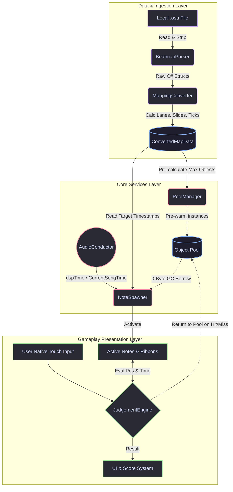

# High-Level Design (HLD) - PulseShift

## 1. Introduction
This HLD outlines the software architecture and system components for **PulseShift**. The architecture is heavily optimized for legacy hardware (Apple A8 chip), strictly enforcing a zero-allocation gameplay loop, pre-calculated data structures, and highly synchronized DSP audio timing to maintain 60 FPS on iOS 12.

---

## 2. System Architecture Overview

PulseShift follows a **Data-Driven Entity-Component** approach (simplified for Unity legacy compatibility, avoiding the heavy overhead of pure ECS frameworks if not native). The system is split into three primary layers:

1.  **Data & Ingestion Layer:** Handles file I/O, `.osu` parsing, and data conversion.
2.  **Core Services Layer:** Singleton managers handling Audio, Memory (Pooling), and Game State.
3.  **Gameplay Presentation Layer:** The active scene elements rendering the notes and registering inputs.

### Data Flow & Memory Pipeline

**Pipeline Rules:**
*   Solid lines (`-->`) represent direct data flow or execution calls.
*   Dotted lines (`-.->`) represent the movement of pre-allocated memory pointers (the Object Pool), demonstrating how PulseShift maintains a zero-allocation loop during the active Play State.

---

## 3. Core Modules & Subsystems

### 3.1 Beatmap Processing Subsystem
Responsible for transforming raw text into gameplay-ready memory structures *before* the scene loads.

*   **`BeatmapParser`:** 
    *   Reads the file synchronously or asynchronously using `System.IO.StreamReader`.
    *   Strips out unnecessary *osu!* data (storyboard events, video offsets) to save memory.
    *   Outputs a lightweight `RawBeatmap` object.
*   **`MappingConverter`:**
    *   Takes `RawBeatmap` and applies coordinate math to assign lanes/zones.
    *   **Slide Generator:** Iterates through bezier curves/slider lengths, calculates the exact $X, Y$ coordinates for the visual ribbon at fixed intervals, and caches them into an array.
    *   Calculates exact `dspTime` timestamps for every hit circle and slide tick.
    *   Outputs the final `ConvertedMapData` object, which is strictly composed of value types (`structs`) where possible to reduce heap fragmentation.

### 3.2 Memory Management (The Object Pooler)
Critical for maintaining 60 FPS on 1 GB RAM without triggering the Garbage Collector.

*   **`PoolManager`:**
    *   Analyzes `ConvertedMapData` during the loading screen to determine the maximum concurrent notes needed (e.g., maximum active objects on screen + 10% buffer).
    *   Instantiates all `TapNote`, `SlideNode`, `SlideRibbon`, and `HitEffect` GameObjects at launch.
    *   Deactivates them and stores them in a fixed-size array or `Queue`.
    *   During gameplay, `NoteSpawner` calls `PoolManager.Get(Type)` and `PoolManager.Return(GameObject)`. **No `Instantiate()` or `Destroy()` calls are permitted after the loading screen.**

### 3.3 Audio & Synchronization Subsystem (The Conductor)
The single source of truth for all game time. Unity's `Time.deltaTime` is ignored for gameplay logic to prevent desynchronization during frame drops.

*   **`AudioConductor`:**
    *   Wraps Unity's `AudioSource`.
    *   Records `AudioSettings.dspTime` exactly when `AudioSource.Play()` is fired.
    *   Exposes a public `CurrentSongTime` property: `(float)(AudioSettings.dspTime - startDspTime) - offset`.
    *   All visual interpolations (moving notes down the screen) use `CurrentSongTime` rather than frame increments.

### 3.4 Gameplay Subsystem
The high-frequency execution loop.

*   **`NoteSpawner`:**
    *   Maintains an index of the next unspawned note in `ConvertedMapData`.
    *   If `CurrentSongTime + ApproachRateTime >= NextNote.Timestamp`, it requests a note from the `PoolManager` and activates it.
*   **`JudgementEngine`:**
    *   Polls native touch inputs via `Input.touches` (avoids allocations from newer Input System wrappers).
    *   **Tap Evaluation:** Checks discrete `TouchPhase.Began` events against the timestamps of active tap notes in the target lane.
    *   **Slide Evaluation:** For active slides, polls `TouchPhase.Moved` and `TouchPhase.Stationary`. As `CurrentSongTime` passes a pre-calculated Slide Tick timestamp, it verifies if a valid touch exists within the acceptable $X/Y$ bounds.

---

## 4. UI & Rendering Strategy

To adhere to the minimalistic aesthetic and device constraints:

*   **Rendering:** Use Unlit or Mobile-optimized shaders. No normal maps, no real-time shadows.
*   **Slide Ribbons:** Use Unity's `LineRenderer` configured to use world space. Set the vertex count to the pre-calculated points from the `MappingConverter`. Apply a solid, flat texture with simple vertex alpha fading at the tail.
*   **Canvas:** Canvas must be set to "Screen Space - Camera". Group static UI elements (Combo text label, borders) into one Canvas, and highly dynamic elements (Combo number, floating hit text) into a separate Canvas to prevent dirtying and rebuilding the entire UI mesh every frame.

---

## 5. State Machine Diagram

*App Flow transitions managed by a lightweight State Manager.*

1.  **Boot State:** Initialize global services (Settings, Audio).
2.  **Menu State:** Scan `Documents` directory. Populate song list. Load custom UI themes.
3.  **Load State:** 
    *   Parse `.osu`.
    *   Convert Map.
    *   Pre-warm Object Pools.
    *   Call `System.GC.Collect()` forcefully *before* transitioning to Play State to ensure a clean heap.
4.  **Play State:** Execution of the zero-allocation gameplay loop.
5.  **Result State:** Tally accuracy, grades, and save high scores.

---

## 6. Edge Case Handling

*   **Audio Desync:** If the OS interrupts the audio (e.g., a notification occurs), `AudioSettings.dspTime` continues but playback might stutter. The `AudioConductor` must detect discrepancies between `AudioSource.time` and calculated DSP time, triggering a micro-pause or resync if the delta exceeds 50ms.
*   **OOM (Out of Memory):** Implemented a hard limit on Beatmap size. Maps exceeding a predefined hit-object count (e.g., death-stream marathon maps) will be rejected during the Menu State to prevent crashing the iPhone 6 during the pre-warming phase.