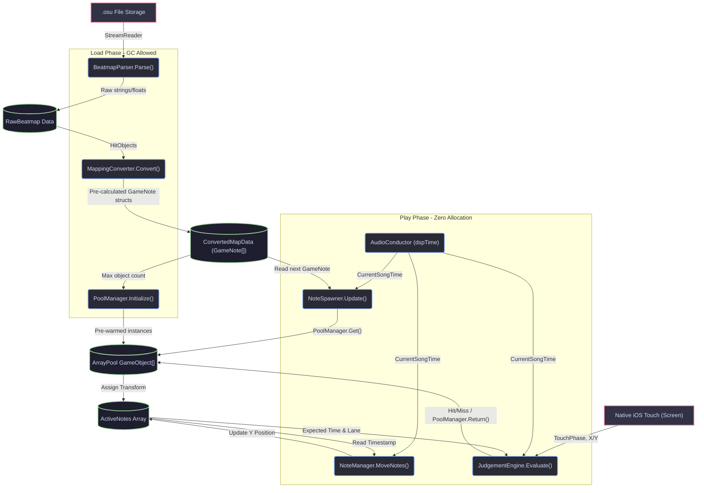

# Low-Level Design (LLD) - PulseShift

## 1. Introduction
This LLD defines the internal logic, class structures, data models, and critical algorithms for PulseShift. The primary directive of this design is **Hardware Sympathy** for the Apple A8 chip: prioritizing cache-friendly data structures, zero-allocation update loops, and pre-computation over runtime execution.

---

## 2. Core Data Models & Data Flow

To prevent heap fragmentation and Garbage Collection (GC) spikes, gameplay data is strictly stored in pre-allocated arrays of `structs`. 

### 2.1 The `ConvertedMapData` Model
```csharp
public enum NoteType : byte { Tap, SlideStart, SlideTick, SlideEnd, Spinner }

// Memory footprint: ~16 bytes per note. Highly cache-friendly.
public struct GameNote 
{
    public double Timestamp;      // DSP time of the hit
    public byte LaneIndex;        // 0 to 3 (for a 4-lane setup)
    public NoteType Type;
    public int SlideId;           // Groups Ticks to a specific Slide Ribbon
    public float SlideTargetX;    // Expected X coordinate for Slide Ticks
}

public class ConvertedMapData 
{
    public GameNote[] Notes;      // Fixed size array, pre-allocated on load
    public int TotalNotes;        
    public float ApproachTime;    // How long a note takes to reach the hitline
}
```

### 2.2 Low-Level Data Flow Diagram (DFD)
This diagram maps the lifecycle of a `GameNote` struct from disk ingestion to final player judgement. Note the separation between the **Load Phase** (where arrays are built) and the **Play Phase** (which only reads/writes to pre-existing arrays).



---

## 3. Class Specifications & Subsystems

### 3.1 `AudioConductor` (The Source of Truth)
Unity's `Time.deltaTime` fluctuates. The `AudioConductor` bypasses this by reading directly from the audio hardware.

**Key Fields & Properties:**
*   `private double _dspStartTime;`
*   `private double _songOffset;`
*   `public double CurrentSongTime { get; }`

**Logic Flow:**
```csharp
public void StartSong() {
    _dspStartTime = AudioSettings.dspTime;
    _audioSource.Play();
}

void Update() {
    // Current time in seconds since the song started
    CurrentSongTime = AudioSettings.dspTime - _dspStartTime - _songOffset;
}
```

### 3.2 `BeatmapConverter` (The Math Engine)
Executes asynchronously during the loading screen. Converts *osu!* pixels `(512x384)` to PulseShift lanes.

**Methods:**
*   `public ConvertedMapData Convert(OsuFile file)`
*   **Slide Conversion Logic:**
    1. Read *osu!* slider curve points and length.
    2. Calculate total slider duration: `length / (sliderMultiplier * 100) * beatLength`.
    3. Generate the Start `GameNote`.
    4. Calculate Tick count based on `SliderTickRate`.
    5. Loop through Ticks: interpolate position along the curve, assign lane based on interpolated X, and generate `GameNote` of type `SlideTick`.
    6. Generate the End `GameNote`.

### 3.3 `ZeroAllocPoolManager`
Standard C# `List<T>` resizes internally, causing GC. We use a fixed-size custom array pool.

**Implementation Structure:**
```csharp
public class ArrayPool<T> where T : MonoBehaviour 
{
    private T[] _pool;
    private int _head;

    public void Initialize(T prefab, int size) {
        _pool = new T[size];
        for(int i=0; i<size; i++) {
            _pool[i] = Object.Instantiate(prefab);
            _pool[i].gameObject.SetActive(false);
        }
        _head = 0;
    }

    // O(1) retrieval, NO ALLOCATION
    public T Get() {
        T item = _pool[_head];
        _head = (_head + 1) % _pool.Length;
        item.gameObject.SetActive(true);
        return item;
    }
}
```

### 3.4 `JudgementEngine`
Processes native iOS touch inputs against `GameNote` timestamps.

**Optimization Rules:**
*   **NO LINQ:** `IEnumerable` and LINQ queries (e.g., `.Where()`, `.FirstOrDefault()`) allocate memory. We use strictly standard `for` loops.
*   **NO `foreach`:** Array iteration uses `for(int i=0; i< length; i++)`.

**Touch Evaluation Algorithm:**
```csharp
void Update() 
{
    // 1. Iterate active touches (No GC allocation via Input.touches)
    for (int i = 0; i < Input.touchCount; i++) 
    {
        Touch t = Input.GetTouch(i);
        int touchedLane = GetLaneFromScreenPosition(t.position.x);

        // 2. Tap Judgement
        if (t.phase == TouchPhase.Began) {
            EvaluateTap(touchedLane, AudioConductor.CurrentSongTime);
        }
        
        // 3. Slide Tick Judgement
        if (t.phase == TouchPhase.Moved || t.phase == TouchPhase.Stationary) {
            EvaluateSlideTick(touchedLane, AudioConductor.CurrentSongTime);
        }
    }
}
```

---

## 4. Visual Rendering specific to iPhone 6

### 4.1 Note Movement Algorithm
Notes do not have individual `Update()` scripts or rigidbodies (which are CPU heavy). A single `NoteManager` updates the `Transform.position` of all active notes simultaneously based on DSP time.

```csharp
// NoteManager.cs (Executes every frame)
for(int i = 0; i < ActiveNotesCount; i++) 
{
    Transform noteTransform = ActiveNotesTransforms[i];
    GameNote noteData = ActiveNotesData[i];
    
    // Position = Target Hitline + (Time remaining until hit * Speed)
    float timeRemaining = (float)(noteData.Timestamp - AudioConductor.CurrentSongTime);
    
    // If timeRemaining == 0, Y will be exactly on the hitline (0)
    float newY = timeRemaining * ScrollSpeedMultiplier; 
    
    noteTransform.localPosition = new Vector3(LaneXPositions[noteData.LaneIndex], newY, 0);
}
```

### 4.2 Rendering Slide Ribbons
To render the continuous path without tanking the GPU fill rate:
1.  **Component:** Use Unity's `LineRenderer`.
2.  **Settings:** Set `Corner Vertices` to 0 and `End Cap Vertices` to 0. Apply an Unlit material.
3.  **Position Array:** Pre-fill the `LineRenderer.SetPositions()` array during the loading phase. 
4.  **Animation:** Do *not* move the points of the line dynamically. Instead, move the entire `GameObject` holding the `LineRenderer` downward using the exact same Note Movement Algorithm as the taps. 

---

## 5. Unity Scene Hierarchy & Execution Order

To minimize `Transform` recalculation overhead, maintain a flat hierarchy for active gameplay objects.

### 5.1 Scene Structure
```text
PulseShift_PlayScene
│
├── [Managers] (AudioConductor, JudgementEngine, PoolManager)
│
├── [UI_Canvas] (Screen Space - Overlay)
│   ├── ComboCounter (Dynamic - updates often)
│   ├── ScoreText (Dynamic - updates often)
│   └── StaticBorders (Static - never redraws)
│
├── [Gameplay_World]
│   ├── HitLine (Sprite)
│   ├── [Pool_TapNotes] (Flat list of 100+ deactivated Tap sprites)
│   ├── [Pool_SlideRibbons] (Flat list of 20+ deactivated LineRenderers)
│   └── [Pool_HitEffects] (Flat list of deactivated low-poly impact flares)
```

### 5.2 Script Execution Order (Critical for Sync)
Unity execution order must be explicitly set to ensure input is registered before visuals are moved:
1.  `InputManager` (Captures raw touch)
2.  `AudioConductor` (Updates DSP clock)
3.  `JudgementEngine` (Validates hits/misses and returns hit objects to the pool)
4.  `NoteManager` (Moves surviving objects down the screen)
5.  `UIManager` (Updates combo visual late in the frame)

---

## 6. Known Technical Bottlenecks & Mitigations

| Issue on iPhone 6 | Cause | Mitigation Strategy in LLD |
| :--- | :--- | :--- |
| **Micro-stutters** | Garbage Collector firing to clean up strings or temporary vectors. | Enforce `struct` usage. Pre-allocate all strings (e.g., store "Combo: 1" through "Combo: 1000" in an array at boot, avoiding `.ToString()` at runtime). |
| **Overdraw limit** | Too many transparent textures overlapping. | Disable transparency on the slide ribbons where possible, or use additive blending. Keep Hit Effects under 5 particles. |
| **Long Load Times** | Parsing massive 5MB `.osu` files synchronously blocks the main thread. | Run `BeatmapParser` inside `System.Threading.Tasks.Task.Run()` on a background thread. Only jump back to Unity's main thread to instantiate the Object Pools. |</T>